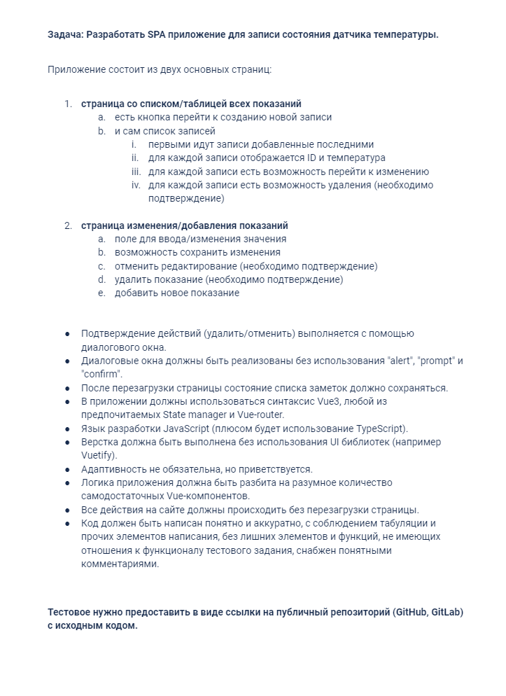
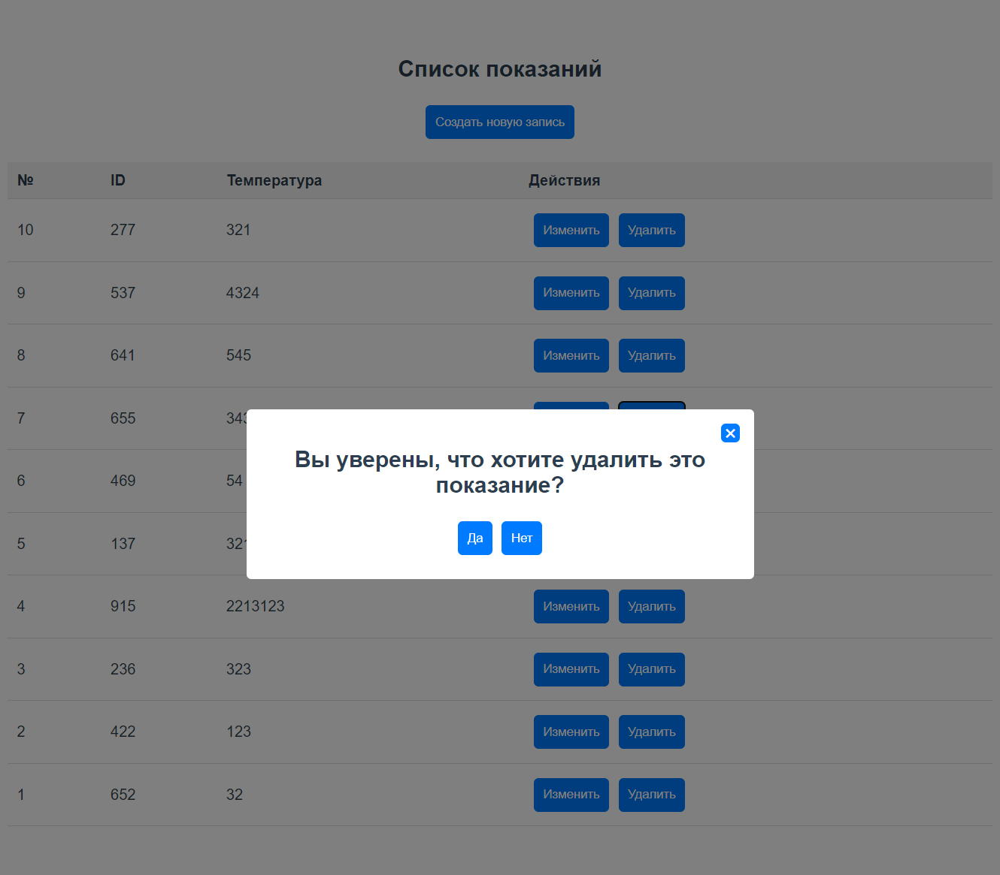

# Vue Temperature Record Manager

### Техническое задание:



### Решение:



Этот проект - простое приложение для управления записями температуры, разработанное с использованием Vue 3, Vue Router, Vuex, TypeScript и SCSS.

## Функциональность

- Создание новой записи о температуре с уникальным ID, сгенерированным на основе текущего времени.
- Вывод всех существующих записей в виде таблицы.
- Редактирование существующей записи.
- Удаление существующей записи с подтверждением через модальное окно.
- Данные сохраняются в localStorage, чтобы они были доступны после обновления страницы.

## Структура проекта

- `CreateOrUpdateRecord.vue`: Этот компонент отвечает за создание новой записи или обновление существующей. Он использует параметр маршрута для определения, редактируется ли существующая запись или создается новая. Сохраненные данные отправляются в хранилище Vuex.
- `ListPage.vue`: Этот компонент выводит все существующие записи в виде таблицы. Он также предоставляет функциональность для удаления записей.
- `ModalWindow.vue`: Этот компонент представляет собой общее модальное окно, которое можно использовать в любом месте приложения.
- `router.ts`: Определяет маршруты для приложения.
- `store.ts`: Определяет хранилище Vuex для управления состоянием приложения.


## Functionality

- Creation of a new temperature record with a unique ID generated based on the current timestamp.
- Display of all existing records in a table format.
- Editing of an existing record.
- Deletion of an existing record with confirmation via a modal window.
- Data is saved in localStorage to remain available upon page refresh.

## Project Structure

- `CreateOrUpdateRecord.vue`: This component is responsible for creating a new record or updating an existing one. It uses the route parameter to determine whether an existing record is being edited or a new one is being created. Saved data is dispatched to the Vuex store.
- `ListPage.vue`: This component displays all the existing records in a table format. It also provides functionality for deleting records.
- `ModalWindow.vue`: This component is a general-purpose modal window that can be used anywhere in the application.
- `router.ts`: Defines the routes for the application.
- `store.ts`: Defines the Vuex store for managing the state of the application.

## Project setup
```
npm install
```

### Compiles and hot-reloads for development
```
npm run serve
```

### Compiles and minifies for production
```
npm run build
```

### Lints and fixes files
```
npm run lint
```

### Customize configuration
See [Configuration Reference](https://cli.vuejs.org/config/).
